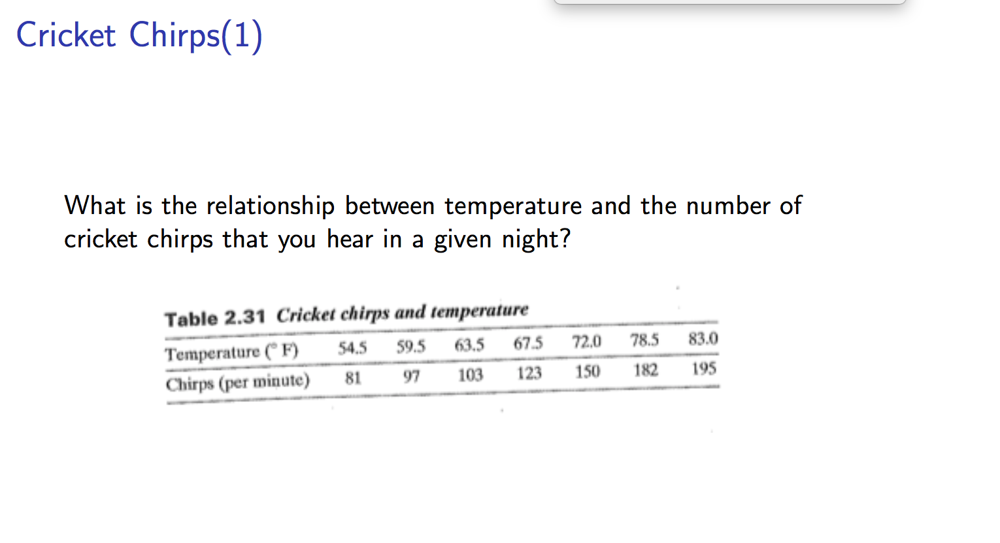

# Week 2 Item 15 -- Cricket Data




```python
# Imports
import pandas as pd
import numpy as np
from sklearn.linear_model import LinearRegression
```


```python
# Create arrays
temp = np.array([54.5, 59.5, 63.5, 67.5, 72.0, 78.5, 83.0])
chirps = np.array([81, 97, 103, 123, 150, 182, 195])
```


```python
# Create dataframe
cricket_data = {"Temp": temp, "Chirps": chirps}
cricket_df = pd.DataFrame(data=cricket_data)

cricket_df
```


<div>
<style scoped>
    .dataframe tbody tr th:only-of-type {
        vertical-align: middle;
    }

    .dataframe tbody tr th {
        vertical-align: top;
    }

    .dataframe thead th {
        text-align: right;
    }
</style>
<table border="1" class="dataframe">
  <thead>
    <tr style="text-align: right;">
      <th></th>
      <th>Temp</th>
      <th>Chirps</th>
    </tr>
  </thead>
  <tbody>
    <tr>
      <th>0</th>
      <td>54.5</td>
      <td>81</td>
    </tr>
    <tr>
      <th>1</th>
      <td>59.5</td>
      <td>97</td>
    </tr>
    <tr>
      <th>2</th>
      <td>63.5</td>
      <td>103</td>
    </tr>
    <tr>
      <th>3</th>
      <td>67.5</td>
      <td>123</td>
    </tr>
    <tr>
      <th>4</th>
      <td>72.0</td>
      <td>150</td>
    </tr>
    <tr>
      <th>5</th>
      <td>78.5</td>
      <td>182</td>
    </tr>
    <tr>
      <th>6</th>
      <td>83.0</td>
      <td>195</td>
    </tr>
  </tbody>
</table>
</div>


```python
# build classifier (clf)
clf = LinearRegression()

# fit linear model
clf.fit(chirps.reshape(-1, 1), temp.reshape(-1, 1))
```


    LinearRegression()


### Regression equation
y = wx + b


```python
# Coefficient = weight = w
w = clf.coef_
w
```


    array([[0.23066586]])


```python
# Intercept = b
b = clf.intercept_
b
```


    array([37.67858381])


### Our equation

y = .23066586x + 37.67858381


```python
# Create function to crunch numbers
def chirps(x):
    return w * x + b
```


```python
# Test x values to predict y values
chirps(85)
```


    array([[57.2851817]])


Our model predicts that if a cricket chirps 85 times per minute, the temp will be roughly 57 degrees F.
